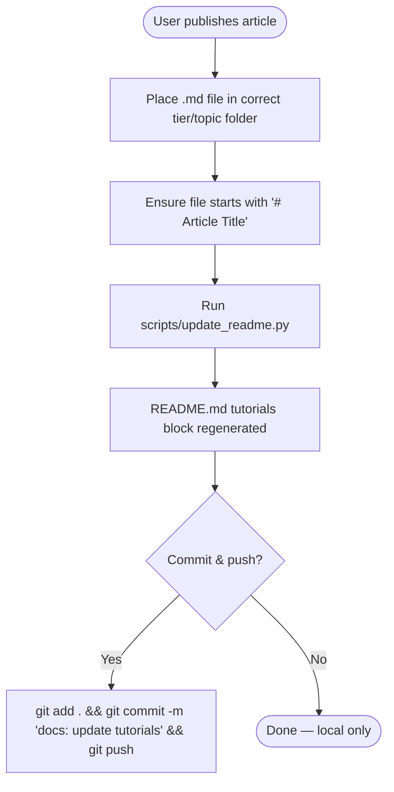

# Update README — Tutorial & Passage Manager

## When to Use
- User drops a new `.md` article into any `tutorials/tier*/topic/` folder
- User asks to "publish a tutorial", "update my README", "add a passage", or "refresh my profile"
- The `<!-- TUTORIALS:START -->` / `<!-- TUTORIALS:END -->` block in `README.md` is stale or missing

---

## Repository Layout

```
tutorials/
  tier1/          ← Primary focus topics (Python, C#, Unity, Blender, Photoshop, Git, MCP, Stable Diffusion)
  tier2/          ← Building experience (Unreal Engine, JavaScript, ROS 2, HTML, Godot)
  tier3/          ← Exploring (Ethereum, Raspberry Pi, STM32)
```

Each topic folder contains:
- `_index.md` — topic overview (never surfaced as an article link)
- `YYYY-MM-DD-article-slug.md` — individual tutorials/passages (surfaced as links)

Every article file **must** have a top-level heading (`# Article Title`) — that heading becomes the hyperlink text in README.md.

---

## Workflow



### Step-by-step

1. **Place the article** in the right folder:
   ```
   tutorials/tier1/python/2026-03-06-my-topic.md
   ```
2. **Verify the title heading** — the first line of the file must be:
   ```markdown
   # My Article Title
   ```
3. **Run the update script** from the repo root:
   ```powershell
   python .copilot/skills/update-readme/scripts/update_readme.py
   ```
4. **Commit and push** (optional — do this automatically when the user asks):
   ```powershell
   git add README.md tutorials/
   git commit -m "docs: add [topic] tutorial — [title]"
   git push
   ```

---

## README Markers

The script rewrites everything between these two HTML comments in `README.md`:

```
<!-- TUTORIALS:START -->
...auto-generated content...
<!-- TUTORIALS:END -->
```

**Never edit the content between the markers by hand** — it will be overwritten on the next run.

---

## Adding a New Topic Folder

If the user needs a brand-new topic not already listed in `TOPIC_LABELS` inside the script:

1. Create the folder: `tutorials/tierN/<new-topic>/`
2. Add `_index.md` with a short description
3. Add the topic to `TOPIC_LABELS` in `scripts/update_readme.py`:
   ```python
   "new-topic": "Display Name",
   ```
4. Run `python .copilot/skills/update-readme/scripts/update_readme.py`

---

## Script Location

[scripts/update_readme.py](scripts/update_readme.py)
