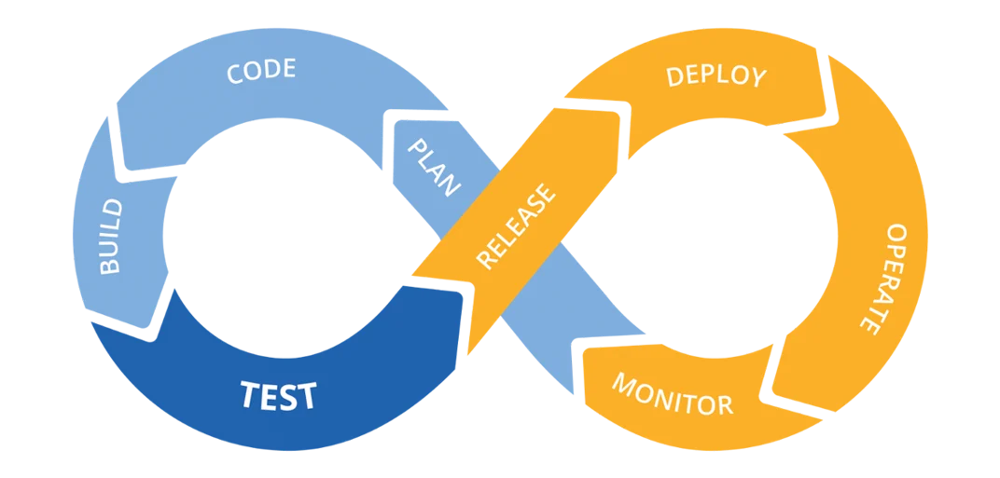

 

 

## Tech

  

 

**Proficiency Scale:**
-  — **Foundational**: Basic Syntax, basic prototyping experience and basic code reading.
-  — **Proficient**: Progressive understanding of trade-offs performance, resilience and security feature, and strong comfort and familiarity with syntax and concepts.
-  — **Mastery**: Performance, resilience and security optimization, design-phase trade-off analysis, standard library source code debugging.

| Scope | Stage | Technology |
|:---:|:---|:---|
|  | **Plan** |   [[url-shortener]](https://github.com/boycececil666gmailcom/url-shortener) [[enterprise-rag-engine]](https://github.com/boycececil666gmailcom/enterprise-rag-engine) |
|  | **Code** |       (  /  [[project-wildcard]](https://boycececil.itch.io/the-wildcard) )   (  [[url-shortener]](https://github.com/boycececil666gmailcom/url-shortener) [[enterprise-rag-engine]](https://github.com/boycececil666gmailcom/enterprise-rag-engine) /  /  [[nn-fundamental]](https://github.com/boycececil666gmailcom/nn-fundamental) )   (  [[url-shortener]](https://github.com/boycececil666gmailcom/url-shortener) /  [[url-shortener]](https://github.com/boycececil666gmailcom/url-shortener) /  /  [[enterprise-rag-engine]](https://github.com/boycececil666gmailcom/enterprise-rag-engine) ) |
|  | **Build** |   [[url-shortener]](https://github.com/boycececil666gmailcom/url-shortener)   |
|  | **Test** |   [[url-shortener]](https://github.com/boycececil666gmailcom/url-shortener)   |
|  | **Release** |   [[enterprise-rag-engine]](https://github.com/boycececil666gmailcom/enterprise-rag-engine)   |
|  | **Deploy** |   [[url-shortener]](https://github.com/boycececil666gmailcom/url-shortener) [[enterprise-rag-engine]](https://github.com/boycececil666gmailcom/enterprise-rag-engine)   [[url-shortener]](https://github.com/boycececil666gmailcom/url-shortener) [[enterprise-rag-engine]](https://github.com/boycececil666gmailcom/enterprise-rag-engine)   [[enterprise-rag-engine]](https://github.com/boycececil666gmailcom/enterprise-rag-engine)   |
|  | **Operate** |   [[url-shortener]](https://github.com/boycececil666gmailcom/url-shortener) [[enterprise-rag-engine]](https://github.com/boycececil666gmailcom/enterprise-rag-engine)   [[enterprise-rag-engine]](https://github.com/boycececil666gmailcom/enterprise-rag-engine) |
|  | **Monitor** |   |

 

| Field | Technology |
|-------|------------|
| **Hobby Technology** |         [[pygl-renderer]](https://github.com/boycececil666gmailcom/pygl-renderer) |

---

## Projects
| Repo | Description | Tech Stack |
|------|-------------|------------|
| [pygl-renderer](https://github.com/boycececil666gmailcom/pygl-renderer)  | Modular 3D OpenGL rendering engine in Python supporting glTF/GLB geometry, PBR materials, and camera controls |    |
| [enterprise-rag-engine](https://github.com/boycececil666gmailcom/enterprise-rag-engine)  | Modular local RAG backend featuring BM25 & dense vector hybrid search, RRF, local heuristic reranking, and query expansion |          |
| [url-shortener](https://github.com/boycececil666gmailcom/url-shortener)  | Production-grade auth microservice: JWT RS256 asymmetric signing, Google OIDC, Redis refresh token rotation, bcrypt password hashing, and zero-trust API Gateway verification |         |
| [nn-fundamental](https://github.com/boycececil666gmailcom/nn-fundamental)  | From-scratch neural network implementation in Python/NumPy covering core activations, multi-layer feedforward propagation, and classification dynamics |   |
| [project-wildcard](https://github.com/boycececil666gmailcom/project-wildcard)  | Game project built in Godot |  |

---

